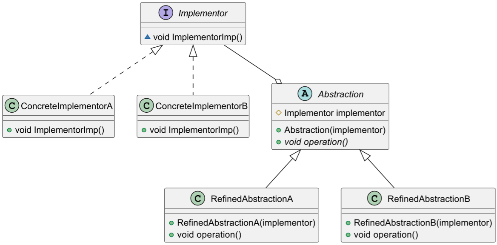
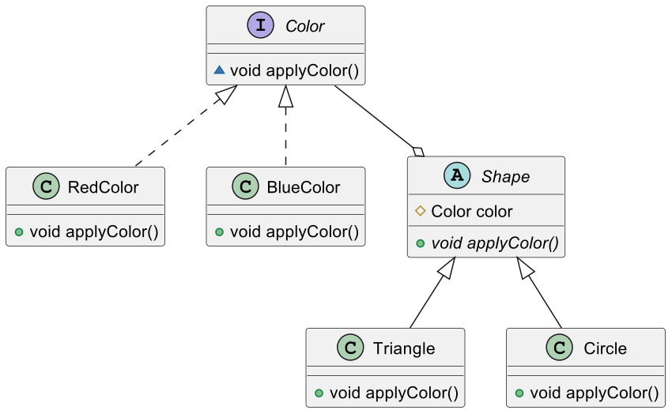

## 模式举例

JDBC是Java数据库连接的标准，它定义了一套接口，而各个数据库厂商则提供了这些接口的具体实现。这样，Java程序就可以通过这套统一的接口，连接到各种不同的数据库，而不需要关心具体的数据库实现。这就是一个典型的桥接模式的应用。

在Java的远程方法调用（RMI）中，也使用到了桥接模式。在RMI中，一个远程对象（抽象部分）可以有多种不同的通信协议（实现部分），例如可以用TCP/IP协议，也可以用HTTP协议。这样，远程对象就可以独立于通信协议进行变化，而通信协议也可以独立于远程对象进行变化。

## 模式定义

::: tip

桥接模式（Bridge Pattern），**将抽象部分与它的实现部分分离，使它们都可以独立地变化**。这样可以防止在多维度变化时出现"类爆炸"的问题，提高了系统的可扩展性。

:::

桥接模式是一种对象结构型，又称为柄体（`Handleand Body`）或接口（`Interface`）模式。

在桥接模式中，抽象部分和实现部分可以独立地进行变化，它们之间的关系通过桥接来实现，而不是通过继承来实现。这样，如果抽象部分需要添加新的功能，或者实现部分需要添加新的实现，都不会影响到另一部分。

这种解耦的好处是，可以使得系统更加灵活，更容易应对变化。

桥接模式适用于，当一个系统不希望使用继承或因为多层继承导致系统类的个数急剧增加时。

## 角色分析



1. **抽象化（`Abstraction`）**：定义抽象类，并包含一个对实现化对象的引用。
2. **扩展抽象化（`RefinedAbstraction`）**：是抽象化类的子类，实现父类中的业务方法，并通过组合方式使用实现化对象。
3. **实现化（`Implementor`）**：定义实现化角色的接口，提供基本操作的接口方法。
4. **具体实现化（`ConcreteImplementor`）**：实现化角色接口的具体实现类。

## 示例代码

```java
// Implementor
interface Color {
    void applyColor();
}

// ConcreteImplementor
class RedColor implements Color {
    public void applyColor(){
        System.out.println("red.");
    }
}

class BlueColor implements Color {
    public void applyColor(){
        System.out.println("blue.");
    }
}

// Abstraction
abstract class Shape {
    protected Color color;
    public Shape(Color color){
        this.color = color;
    }
    abstract public void applyColor();
}

// RefinedAbstraction
class Triangle extends Shape {
    public Triangle(Color color){
        super(color);
    }
    public void applyColor(){
        System.out.print("Triangle filled with color ");
        color.applyColor();
    } 
}

class Circle extends Shape {
    public Circle(Color color){
        super(color);
    }
    public void applyColor(){
        System.out.print("Circle filled with color ");
        color.applyColor();
    } 
}

public class Client {
    public static void main(String[] args) {
        Shape tri = new Triangle(new RedColor());
        tri.applyColor();

        Shape cir = new Circle(new BlueColor());
        cir.applyColor();
    }
}
```

在这个例子中，`Shape`是抽象化角色，`Triangle`和`Circle`是扩展抽象化角色，`Color`是实现化角色，`RedColor`和`BlueColor`是具体实现化角色。通过桥接模式，我们可以独立地改变或扩展`Shape`和`Color`，使得二者的接口可以独立地变化。



## 模式总结


> “桥接模式实现比较复杂，实际应用也非常少，但它提供的设计思想值得借鉴，即不要过度使用继承，而是优先拆分某些部件，使用组合的方式来扩展功能。”

实际上桥接模式的关注点在于，尽量少使用继承，而采用组合的方式来实现它们的变化。因为当一个类有多个变化的维度时，如果每个维度的变化都通过继承来实现，那么会产生大量的子类，这就是所谓的"类爆炸"。使用桥接模式可以使它们独立变化，减少耦合。

在桥接模式中，不仅`Implementor`具有变化，而且`Abstraction`也可以发生变化，这是一个多对多的关系，而且两者的变化是完全独立的。`RefinedAbstraction`与`ConcreteImplementior`之间是松散耦合，它仅仅是通过`Abstraction`与`Implementor`之间的聚合关系联系起来。根据类变化的属性，抽象形成接口（或抽象类），可实现多个维度的独立化。