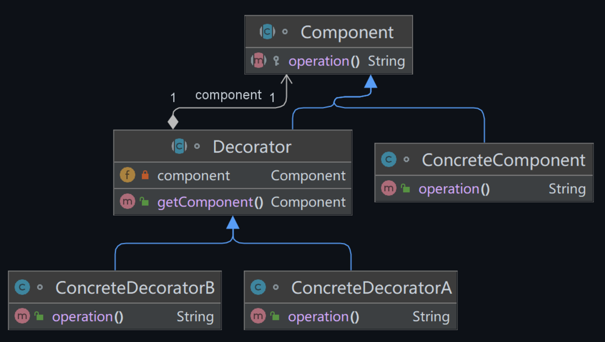
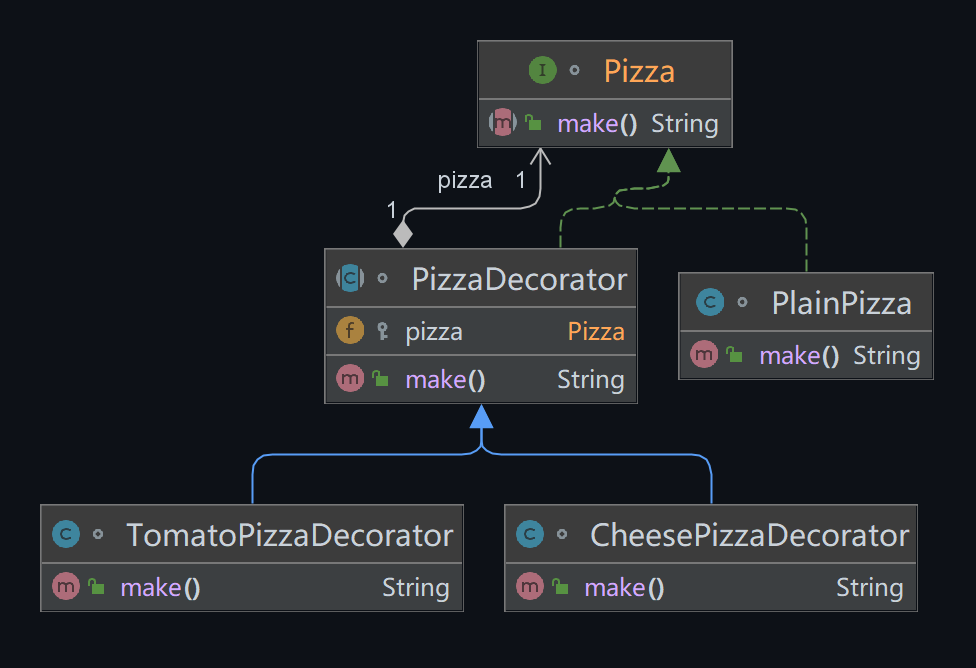

## 模式举例

Java的输入/输出(I/O)类库广泛使用了装饰模式。例如，`BufferedReader`、`BufferedWriter`、`PrintStream`等都是装饰器，它们都继承自`Reader`、`Writer`、`OutputStream`等抽象组件，为其添加了缓冲、打印等额外功能。

再举一个例子，在Java的集合类库中，也使用了装饰模式。例如，`Collections`类提供了一系列的静态方法，可以为一个集合添加同步、只读、不可修改等额外功能。比如`Collections.synchronizedList`就是一个装饰器，它为`ArrayList`添加了同步的功能。

## 模式定义

::: tip 定义

装饰模式（Decorator Pattern），不改变原有对象的前提下，动态地给一个对象增加一些额外的功能。

:::

通常，我们可以通过继承来扩展类的功能，但是随着扩展的增多，子类的数量也会随之增加。装饰模式提供了一种无需定义子类，就能动态地为对象添加额外功能的方法。

具体来说，这是通过将原始对象封装在一个具有特定行为的装饰类中实现的，这样就可以为原始对象动态地添加新的行为，而无需修改其源代码。这种方法非常符合**合成-聚合复用原则**，即优先使用对象组合而非继承来实现功能的复用。

装饰模式通常适用于以下场景：

- 当需要为现有类添加新的功能或行为，但又不希望修改其源代码时。
- 当需要通过组合方式实现功能的任意组合，而不是通过继承方式时。

## 模式分析



装饰模式允许我们在运行时动态地为对象添加行为，涉及四个角色：

1. **抽象组件（`Component`）**：定义了对象的接口，可以为这些对象动态地添加行为。
2. **具体组件（`ConcreteComponent`）**：实现了 `Component` 接口的具体类，它是被装饰的对象。
3. **抽象装饰类（`Decorator`）**：持有一个指向抽象组件对象的引用，用于给具体组件添加功能。具体的装饰行为由其子类实现。
4. **具体装饰类（`ConcreteDecorator`）**：为组件添加职责，实现动态装饰。

装饰模式通过创建一个装饰类来包裹真实的对象，从而扩展其功能。装饰类与真实对象具有相同的接口，因此它们是可以互换的。

在装饰模式中，可以使用多个装饰类来装饰一个对象，从而动态地、顺序地添加新的行为。装饰模式是一种替代继承的技术，它无需定义子类就能扩展对象的功能，符合开闭原则。

## 示例代码

```java
// 抽象组件
interface Pizza {
    String make();
}

// 具体组件
class PlainPizza implements Pizza {
    @Override
    public String make() {
        return "Plain Pizza";
    }
}

// 抽象装饰类
abstract class PizzaDecorator implements Pizza {
    protected Pizza pizza;

    public PizzaDecorator(Pizza pizza) {
        this.pizza = pizza;
    }

    public String make() {
        return pizza.make();
    }
}

// 具体装饰类
class CheesePizzaDecorator extends PizzaDecorator {
    public CheesePizzaDecorator(Pizza pizza) {
        super(pizza);
    }

    public String make() {
        return pizza.make() + " + Cheese";
    }
}

// 具体装饰类
class TomatoPizzaDecorator extends PizzaDecorator {
    public TomatoPizzaDecorator(Pizza pizza) {
        super(pizza);
    }

    public String make() {
        return pizza.make() + " + Tomato";
    }
}

// 使用装饰器
public class Main {
    public static void main(String[] args) {
        Pizza pizza = new TomatoPizzaDecorator(new CheesePizzaDecorator(new PlainPizza()));
        System.out.println(pizza.make());  // 输出：Plain Pizza + Cheese + Tomato
    }
}
```

运行结果如下：

```
Plain Pizza + Cheese + Tomato
```

类图如下：



## 模式总结

装饰模式在新对象中通过关联关系（包括组合关系和聚合关系）使用已有对象，使之成为新对象的一部分。新对象通过委托调用已有对象的方法，实现对其功能的复用。

抽象装饰类聚合了抽象构件对象，使得方法调用具有层次关系。装饰的顺序决定了对象方法的调用顺序。

装饰模式的优点在于其灵活性，它提供了一种在运行时扩展对象功能的方式，这比在编译期通过继承实现功能扩展更加灵活。通过运行时配置不同的装饰器，可以实现不同的行为。通过不同的装饰器组合，可以实现不同的效果。

装饰者和被装饰者可以独立变化，用户可以根据需要增加新的装饰类，并在使用时对其进行组合，无需修改原有代码。因此，装饰模式符合开闭原则。然而，装饰模式的缺点在于需要创建一些具体装饰类，这可能会增加系统的复杂性。