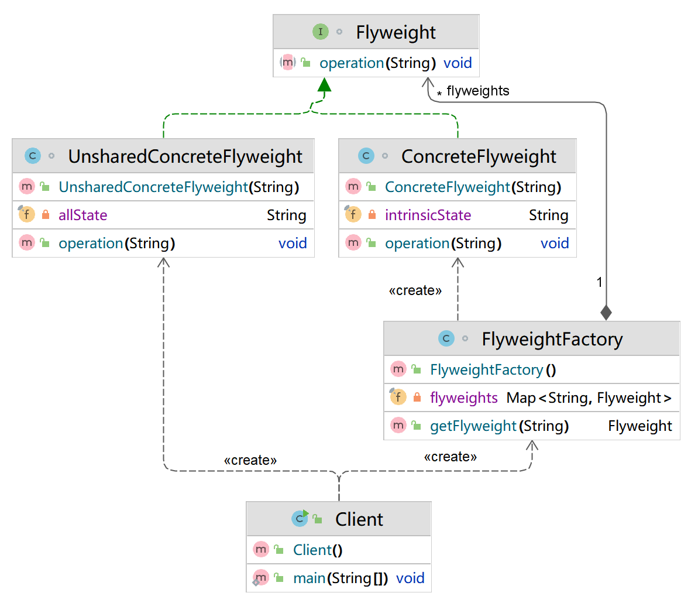

## 模式举例

`String`类就使用了享元模式的思想。当我们创建一个`String`对象时，`JVM`首先会在字符串常量池中查找是否存在相同的字符串，如果存在，则返回常量池中的对象，否则新建一个字符串对象。

类似的还有包装类的值缓存，如`Integer`、`Long`等包装类会缓存一定范围内的值，当我们调用`valueOf`方法时，如果值在缓存范围内，就直接返回缓存的对象。

## 模式定义

享元模式是一种结构型设计模式，它的主要目标是实现对象的共享，即共享的对象可以被多个上下文同时使用，而无需在每个上下文中都创建新的对象。

::: tip 定义

享元模式（Flyweight  Pattern），运用共享技术有效地支持大量细粒度对象的复用。**系统只使用少量的对象，而这些对象都很近，状态变化很小，对象使用次数增多。**

:::

在享元模式中，享元工厂负责管理享元对象。它通常使用一个集合来存储已经创建的享元对象。当请求一个享元对象时，享元工厂会首先检查这个对象是否已经存在，如果存在就直接返回，否则就创建一个新的享元对象。这样，就可以实现享元对象的共享，从而节省内存。

## 内部状态与外部状态

在享元模式中，对象的状态被划分为两种：

1. **内部状态**：这是享元对象的固有属性，一旦创建，就不会改变。内部状态可以被多个上下文共享，因为它们不依赖于特定的场景，因此可以被内部化。

2. **外部状态**：这是享元对象依赖的上下文信息，由享元对象的使用者提供，会根据使用场景而改变。外部状态不能被共享，因为它们会随着上下文的变化而变化，因此它们被外部化。

如何理解？举个例子，比如我们在下围棋，此时：

1. **内部状态**：棋子的颜色（黑色或白色）。这是棋子的固有属性，一旦棋子被创建，颜色就不会改变。无论棋子被放在棋盘的哪个位置，它的颜色都是一样的。因此，颜色可以被视为棋子的内部状态。
2. **外部状态**：棋子在棋盘上的位置。这是棋子的外部状态，它会随着游戏的进行而改变。每个棋子的位置都是独立的，不能被其他棋子共享。因此，位置可以被视为棋子的外部状态。

## 角色分析


享元模式主要包含以下几种角色：

1. **抽象享元（Flyweight）**：这是所有具体享元类的超类或接口，通过这个接口，Flyweight可以接受并作用于外部状态。
2. **具体享元（Concrete Flyweight）**：实现抽象享元接口，并为内部状态增加存储空间。这些对象必须是可共享的，它们包含的状态必须是内部的。
3. **非共享具体享元（Unshared Concrete Flyweight）**：并不是所有的抽象享元子类都需要被共享。Flyweight接口使共享成为可能，但它并不强制共享。在Flyweight模式中，非共享具体享元只是抽象享元的一个子类。实例化这些类的对象时并不共享。
4. **享元工厂（Flyweight Factory）**：创建并管理享元对象，享元工厂是一个享元池的实现。当用户请求一个享元时，享元工厂提供一个已创建的实例或者创建一个（如果不存在的话）。

## 示例代码

```java
import java.util.HashMap;
import java.util.Map;

// 抽象享元角色 - Flyweight
interface Flyweight {
    void operation(String externalState);
}

// 具体享元角色 - ConcreteFlyweight
class ConcreteFlyweight implements Flyweight {
    private final String intrinsicState; // 内部状态

    public ConcreteFlyweight(String intrinsicState) {
        this.intrinsicState = intrinsicState;
    }

    @Override
    public void operation(String externalState) {
        System.out.println("Intrinsic State = " + this.intrinsicState);
        System.out.println("External State = " + externalState);
    }
}

// 非共享具体享元角色 - UnsharedConcreteFlyweight
class UnsharedConcreteFlyweight implements Flyweight {
    private final String allState; // 所有状态

    public UnsharedConcreteFlyweight(String allState) {
        this.allState = allState;
    }

    @Override
    public void operation(String externalState) {
        System.out.println("All State = " + this.allState);
        System.out.println("External State = " + externalState);
    }
}

// 享元工厂角色 - FlyweightFactory
class FlyweightFactory {
    private final Map<String, Flyweight> flyweights = new HashMap<>();

    public Flyweight getFlyweight(String key) {
        Flyweight flyweight = flyweights.get(key);
        if (flyweight == null) {
            // 如果对象不存在则创建一个新的Flyweight对象
            flyweight = new ConcreteFlyweight(key);
            // 把这个新的Flyweight对象添加到缓存中
            flyweights.put(key, flyweight);
        }
        return flyweight;
    }
}


public class Client {
    public static void main(String[] args) {
        // 创建一个享元工厂
        FlyweightFactory factory = new FlyweightFactory();

        // 通过享元工厂获取两个享元对象
        Flyweight flyweight1 = factory.getFlyweight("A");
        Flyweight flyweight2 = factory.getFlyweight("A");

        // 检查这两个享元对象是否相同
        System.out.println(flyweight1 == flyweight2); // 输出：true

        // 使用享元对象
        flyweight1.operation("External State1");
        flyweight2.operation("External State2");

        // 获取并使用非共享的享元对象
        Flyweight unsharedFlyweight = new UnsharedConcreteFlyweight("All State");
        unsharedFlyweight.operation("External State3");
    }
}
```

运行结果如下：

```
true
Intrinsic State = A
External State = External State1
Intrinsic State = A
External State = External State2
All State = All State
External State = External State3
```

类图如下：



## 模式总结

享元模式主要用于优化性能，特别是在处理大量相似对象时。通过共享相同的内部状态，享元模式可以大大减少内存的使用，提高程序的性能。

但是，它也有一些缺点，例如，享元对象的状态不能随意改变，否则可能会影响到其他共享同一个享元对象的地方。因此，在使用享元模式时，需要仔细考虑其适用性和可能的影响。

