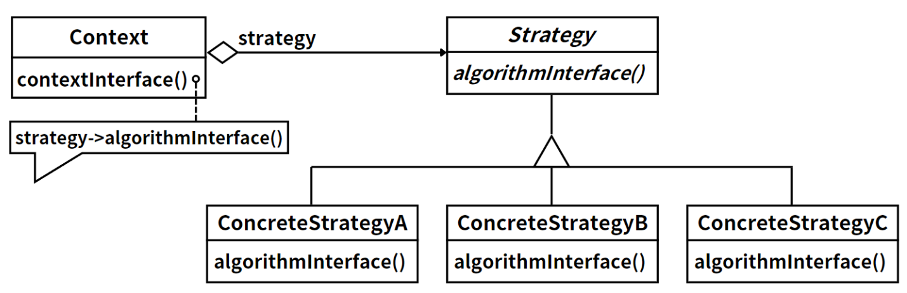
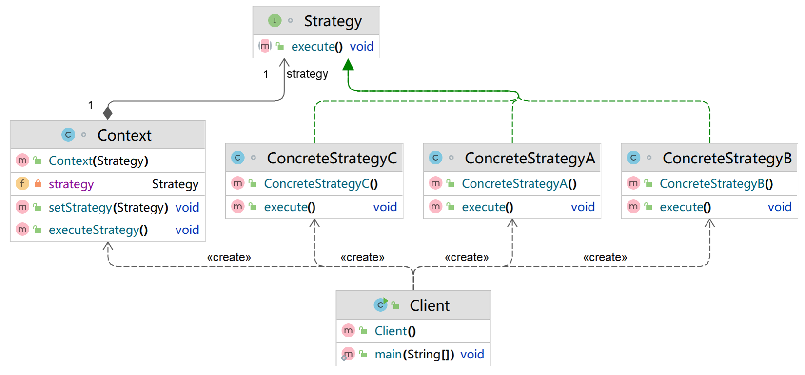

## 模式举例

在Java标准库中，`java.util.Comparator`接口就是策略模式的一个典型应用。`Comparator`接口定义了一个比较两个对象的策略，然后在如`java.util.Arrays.sort()`或`java.util.Collections.sort()`等方法中，可以传入一个实现了`Comparator`接口的对象，来指定排序的策略。

## 模式定义

完成一项任务，往往可以有多种不同的方式，每一种方式称为一个策略（Strategy），我们可以根据环境或者条件的不同选择不同的策略来完成该项任务。

::: tip 定义

策略模式（Strategy Pattern），**定义一系列算法，将每一个算法封装起来，并让它们可以相互替换**。策略模式让算法独立于使用它的客户而变化。

:::

例如，电商网站的商品折扣策略可能会根据不同的算法进行调整，如新用户满减优惠，或者根据会员等级提供不同的折扣。如果直接在代码中硬编码这些策略，可能会导致大量的 if-else 语句，并且每次优惠政策变动时，都需要修改原有代码，这违反了开闭原则。

策略模式的应用可以解决这个问题。我们可以将各种优惠算法封装为独立的类，以避免大量的条件语句。当需要添加新的优惠算法时，我们只需添加新的策略类即可，而无需修改客户端代码。这样，客户端在运行时可以选择不同的具体策略，而无需为改变优惠策略而修改代码。

在策略模式中，抽象策略定义所有算法的公共行为；上下文对象负责维护对策略对象的引用，而具体策略对象则负责实现具体的算法或行为。客户端代码只需要创建上下文对象并传入相应的策略对象即可，无需关心具体的算法或行为实现。

## 角色分析



策略模式的三个角色包括：

1. **上下文（Context）**：上下文类持有一个策略类的引用，同时提供一个接口来让外部代码或客户端代码设置该引用。上下文可以定义一些公共的工作，然后把一些变化的部分委托给策略类处理。
2. **抽象策略（Strategy）**：这是一个接口，由一个或多个方法组成，定义了策略或算法的步骤或行为。
3. **具体策略（Concrete Strategy）**：这些类实现了抽象策略定义的接口，提供具体的算法或行为。在运行时，具体策略对象会替换上下文中的抽象策略对象，以提供具体的行为。

## 示例代码

```java
// 抽象策略
interface Strategy {
    void execute();
}

// 具体策略A
class ConcreteStrategyA implements Strategy {
    @Override
    public void execute() {
        System.out.println("Strategy A executed");
    }
}

// 具体策略B
class ConcreteStrategyB implements Strategy {
    @Override
    public void execute() {
        System.out.println("Strategy B executed");
    }
}

// 具体策略C
class ConcreteStrategyC implements Strategy {
    @Override
    public void execute() {
        System.out.println("Strategy C executed");
    }
}

// 上下文
class Context {
    private Strategy strategy;

    public Context(Strategy strategy) {
        this.strategy = strategy;
    }

    public void setStrategy(Strategy strategy) {
        this.strategy = strategy;
    }

    public void executeStrategy() {
        strategy.execute();
    }
}

public class Client {
    public static void main(String[] args) {
        // 创建具体策略对象
        Strategy strategyA = new ConcreteStrategyA();
        Strategy strategyB = new ConcreteStrategyB();
        Strategy strategyC = new ConcreteStrategyC();

        // 创建上下文对象
        Context context = new Context(strategyA);

        // 使用策略A
        context.executeStrategy();

        // 更改策略为B
        context.setStrategy(strategyB);
        context.executeStrategy();

        // 更改策略为C
        context.setStrategy(strategyC);
        context.executeStrategy();
    }
}
```

运行结果：

```
Strategy A executed
Strategy B executed
Strategy C executed
```

类图如下：



## 模式总结

策略模式是一种行为设计模式，它的主要思想是定义一系列的算法，把它们一个个封装起来，并且使它们可以相互替换。策略模式使得算法可以独立于使用它的客户而变化。

在策略模式中，客户端代码通常创建一个或多个具体策略对象，然后通过上下文的接口将这些对象传递给上下文。客户端代码不需要直接与具体策略类交互，而是通过上下文来使用策略，这样就可以根据需要在运行时更改策略。