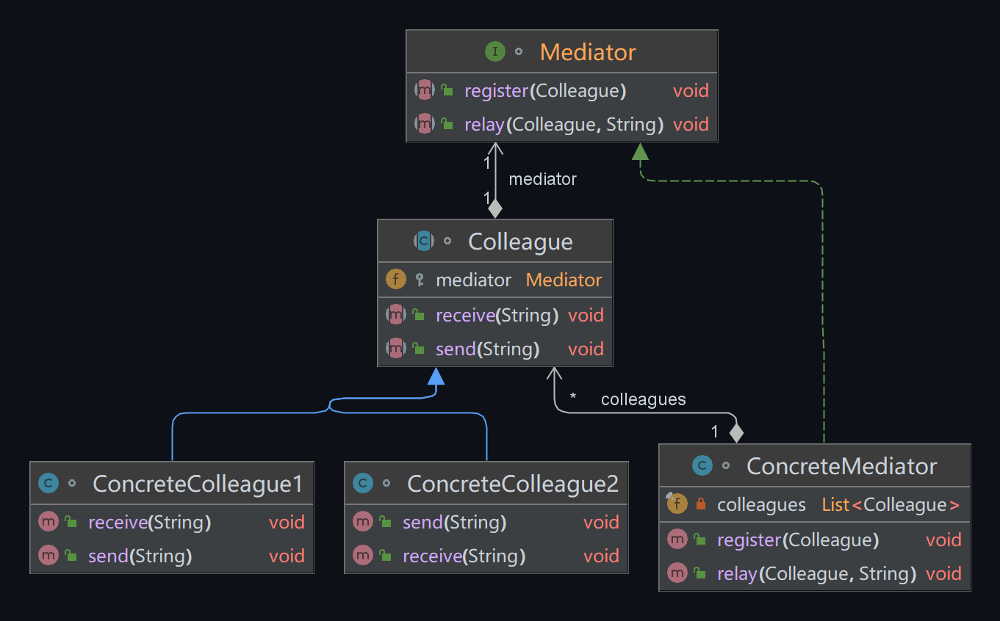

## 模式举例

举个例子，在 `Spring` 框架中，`ApplicationContext` 就是一个中介者。它负责管理 `Bean` 的生命周期，处理 `Bean` 之间的依赖关系，以及提供各种服务，如事件发布、资源加载等。通过 `ApplicationContext`，各个 `Bean` 不需要直接交互，只需要与 `ApplicationContext` 交互，就可以完成各种操作。

## 模式定义

中介者模式是一种行为设计模式，它通过引入一个中介者对象来封装一组对象之间的交互。

::: tip 定义

中介者模式（Mediator Pattern），**用一个中介对象来封装一系列的对象交互**，中介者使各对象不需要显式地相互引用，从而使其耦合松散，而且可以独立地改变它们之间的交互。

:::

在复杂的系统中，对象之间的交互关系可能会非常复杂，对象之间的耦合度高，难以维护和扩展。中介者模式通过引入一个中介者对象，使得系统的各个对象都通过中介者对象来进行交互，从而降低了系统的耦合度。

## 角色分析



中介者模式主要包含两种角色：

1. **中介者（Mediator）**：中介者定义了一个接口用于与各同事（Colleague）对象通信。

2. **同事类（Colleague）**：每一个同事类都知道它的中介者对象，每一个同事对象在需与其他的同事通信的时候，与它的中介者通信。

在这里，抽象中介者`Mediator`定义转发消息的抽象方法，具体中介者`ConcreteMediator`需要重写基类的抽象方法，通过关联`ConcreteColleague`知道来自谁的消息转发给谁。抽象同事类`Colleague`定义发消息和接收消息的抽象方法，通过关联（聚合或组合）`Mediator`实现发送消息到其他同事，具体同事类`ConcreteColleague`需要重写基类的2个抽象方法（收发消息）。

## 示例代码

```java
import java.util.ArrayList;
import java.util.List;

// 抽象中介者
interface Mediator {
    void register(Colleague colleague);

    void relay(Colleague colleague, String message);
}

// 具体中介者
class ConcreteMediator implements Mediator {
    private final List<Colleague> colleagues = new ArrayList<>();

    @Override
    public void register(Colleague colleague) {
        colleagues.add(colleague);
    }

    @Override
    public void relay(Colleague colleague, String message) {
        for (Colleague c : colleagues) {
            if (!c.equals(colleague)) {
                c.receive(message);
            }
        }
    }
}

// 抽象同事类
abstract class Colleague {
    protected Mediator mediator;

    public Colleague(Mediator mediator) {
        this.mediator = mediator;
    }

    public abstract void send(String message);

    public abstract void receive(String message);
}

// 具体同事类1
class ConcreteColleague1 extends Colleague {
    public ConcreteColleague1(Mediator mediator) {
        super(mediator);
    }

    @Override
    public void send(String message) {
        mediator.relay(this, message);
    }

    @Override
    public void receive(String message) {
        System.out.println("Colleague1 received: " + message);
    }
}

// 具体同事类
class ConcreteColleague2 extends Colleague {
    public ConcreteColleague2(Mediator mediator) {
        super(mediator);
    }

    @Override
    public void send(String message) {
        mediator.relay(this, message);
    }

    @Override
    public void receive(String message) {
        System.out.println("Colleague2 received: " + message);
    }
}

// 客户端
public class Main {
    public static void main(String[] args) {
        // 创建中介者
        Mediator mediator = new ConcreteMediator();
        // 创建同事对象
        Colleague colleague1 = new ConcreteColleague1(mediator);
        Colleague colleague2 = new ConcreteColleague2(mediator);
        // 注册同事对象到中介者
        mediator.register(colleague1);
        mediator.register(colleague2);
        // 同事对象之间发送消息
        colleague1.send("Hello from Colleague1!");
        colleague2.send("Hi from Colleague2!");
    }
}
```

运行结果：

```
Colleague2 received: Hello from Colleague1!
Colleague1 received: Hi from Colleague2!
```

## 模式总结

中介者模式是一种行为设计模式，它允许你减少对象之间混乱无序的依赖关系。该模式的主要思想是，不让对象直接彼此交互，而是通过中介者对象进行交互。

要点如下：

1. **降低耦合度**：对象之间不再直接交互，而是通过中介者进行交互，这降低了对象之间的耦合度。

2. **集中控制交互**：所有的交互都被集中在中介者中处理，这使得对象之间的交互更加清晰和可控。

3. **简化对象接口**：对象不再需要知道其他对象的存在和接口，只需要知道中介者即可。

4. **提高灵活性**：通过改变和调整中介者，可以灵活地改变对象之间的交互。

然而，中介者模式也有一些缺点：

1. **中介者可能过于复杂**：如果系统中的交互非常复杂，那么中介者可能会变得非常复杂，难以管理和维护。

2. **系统依赖于中介者**：如果中介者出现问题，可能会影响到整个系统。

因此，中介者模式适用于当系统对象之间存在复杂的交互关系或者系统需要在不同对象之间进行灵活的通信时使用。