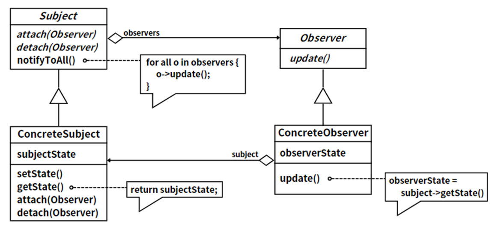

## 模式举例

事件监听机制就是一种典型的观察者模式的应用。例如，当用户点击一个按钮时，会生成一个`ActionEvent`事件，这个事件会被发送给注册了`ActionListener`的对象。也就是说，被观察对象的状态发生改变时，它会通知所有注册的观察者`Observer`。

## 模式定义

::: tip 定义

观察者模式（Observer  Pattern），**定义对象间的一种一对多依赖关系，使得每当一个对象状态发生改变时，其相关依赖对象皆得到通知并被自动更新**。

:::

观察者模式，一种行为设计模式，构建了对象间的依赖关系，使多个观察者能同时监听一个主题对象。当主题对象状态变化，所有依赖的观察者都会自动收到通知并更新。

例如，在开发新闻订阅系统时可以应用观察者模式，此时用户可以订阅感兴趣的新闻主题，一旦有新的新闻发布，系统会自动推送给所有订阅了该主题的用户。

## 角色分析



观察者模式包含四个主要角色：

1. **抽象观察者（`Observer`）**：定义更新接口，用于接收被观察者状态变化的通知并进行相应操作。
2. **被观察者（`Subject`）**：维护观察者列表，支持动态添加或删除观察者。状态变化时，通知所有观察者。
3. **具体观察者（`ConcreteObserver`）**：实现抽象观察者的更新接口，以便在接收到状态变化通知时更新自身。
4. **具体目标（`ConcreteSubject`）**：实现观察目标接口，包含实际业务逻辑。状态变化时，通知所有观察者。

## 示例代码

```java
import java.util.ArrayList;
import java.util.List;

abstract class Observer {
    public abstract void update();
}

abstract class Subject {
    private final List<Observer> observers = new ArrayList<>();

    public void attach(Observer observer) {
        observers.add(observer);
    }

    public void detach(Observer observer) {
        observers.remove(observer);
    }

    public void notifyToAll() {
        for (Observer observer : observers) {
            observer.update();
        }
    }
}

class ConcreteObserver extends Observer {
    private final String name;
    private final ConcreteSubject subject;

    public ConcreteObserver(String name, ConcreteSubject subject) {
        this.name = name;
        this.subject = subject;
    }

    @Override
    public void update() {
        String state = subject.getState();
        System.out.println(name + " received: " + state);
    }
}

class ConcreteSubject extends Subject {
    private String state;

    public String getState() {
        return state;
    }

    public void setState(String state) {
        this.state = state;
        notifyToAll();
    }
}

public class Client {
    public static void main(String[] args) {
        ConcreteSubject subject = new ConcreteSubject();
        Observer observer1 = new ConcreteObserver("Observer 1", subject);
        Observer observer2 = new ConcreteObserver("Observer 2", subject);
        Observer observer3 = new ConcreteObserver("Observer 3", subject);

        subject.attach(observer1);
        subject.attach(observer2);
        subject.attach(observer3);

        subject.setState("New state");
    }
}
```

运行结果：

```
Observer 1 received: New state
Observer 2 received: New state
Observer 3 received: New state
```

## 模式总结

观察者模式是一种行为设计模式，它定义了对象之间的依赖关系，使得当一个对象的状态发生改变时，所有依赖于它的对象都会得到通知并被自动更新。

观察者模式在实际开发中非常常见，例如在GUI开发、实时消息系统、多线程开发等场景中都有广泛应用。它可以实现对象之间的松耦合交互，提高了代码的可维护性和可扩展性。