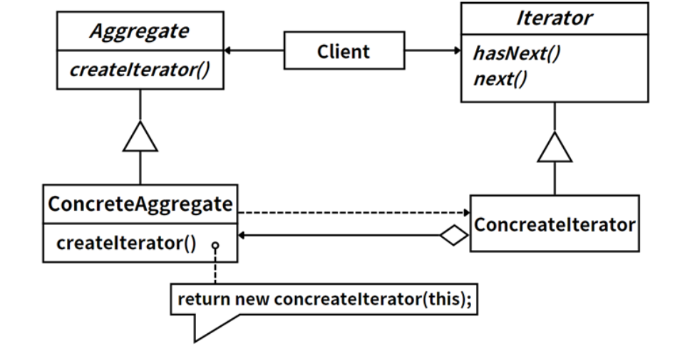

## 模式举例

迭代器模式在Java的集合类库中得到了广泛的应用。Java的集合框架提供了一种标准的方式来遍历集合元素，而无需暴露集合的内部结构。这就是通过实现`java.util.Iterator`接口来实现的。

`Iterator`接口定义了三个方法：

- `hasNext()`：检查是否还有更多的元素。
- `next()`：返回集合中的下一个元素。
- `remove()`：删除集合中的当前元素。

Java的所有集合类（如`ArrayList`、`HashSet`、`LinkedList`等）都实现了`Iterable`接口，该接口定义了一个方法`iterator()`，该方法返回一个`Iterator`对象，可以用来遍历集合。

## 模式定义

::: tip 定义

迭代器模式（Iterator Pattern），**提供一种方法来访问聚合对象，而不用暴露这个对象的内部表示**。

:::

迭代器模式常用于以下场景：

- 当你需要遍历一个复杂的数据结构，但希望对外隐藏其内部细节时。
- 当你希望提供一个统一的接口来遍历不同的数据结构时。

## 角色分析



迭代器模式主要包含以下角色：

1. **迭代器（Iterator）**：这是一个接口，它定义了访问和遍历元素的接口，包含`hasNext()`、`next()`和`remove()`等方法。

2. **具体迭代器（Concrete Iterator）**：实现迭代器接口。具体迭代器会持有对集合对象的引用，用于遍历这个集合对象。

3. **聚合对象（Aggregate）**：这是一个接口，提供一个方法，返回一个迭代器对象。这个迭代器对象能够遍历聚合对象。

4. **具体聚合对象（Concrete Aggregate）**：实现聚合对象接口，返回一个具体的迭代器对象。

在Java的集合框架中，`Iterable`接口就是聚合对象，它定义了一个方法`iterator()`，返回一个迭代器对象。`Iterator`接口就是迭代器，它定义了`hasNext()`、`next()`和`remove()`等方法。具体的集合类（如`ArrayList`、`HashSet`等）就是具体的聚合对象，它们实现了`Iterable`接口，返回一个具体的迭代器对象。

这种模式的好处是，它提供了一种方法来访问一个聚合对象，而无需暴露这个对象的内部表示，也无需关心这个聚合对象的底层实现。这样，如果聚合对象的内部实现发生改变，只需要改变具体的迭代器就可以了，客户端代码不需要改变。

## 示例代码

```java
import java.util.Iterator;

// 聚合对象接口
interface Aggregate {
    Iterator<String> createIterator();
}

// 具体聚合对象
class ConcreteAggregate implements Aggregate {
    private final String[] items;

    public ConcreteAggregate(String[] items) {
        this.items = items;
    }

    @Override
    public Iterator<String> createIterator() {
        return new ConcreteIterator();
    }

    // 具体迭代器
    private class ConcreteIterator implements Iterator<String> {
        private int index = 0;

        @Override
        public boolean hasNext() {
            return index < items.length;
        }

        @Override
        public String next() {
            return hasNext() ? items[index++] : null;
        }
    }
}

public class Client {
    public static void main(String[] args) {
        String[] items = {"Apple", "Banana", "Cherry"};
        Aggregate aggregate = new ConcreteAggregate(items);
        Iterator<String> iterator = aggregate.createIterator();
        while (iterator.hasNext()) {
            System.out.println(iterator.next());
        }
    }
}
```

## 模式总结

迭代器模式提供了一种方法顺序访问一个聚合对象中各个元素，而又不暴露该对象的内部表示。这种模式可以帮助我们抽象出遍历的过程，使得无需关心数据结构的内部构造，就可以遍历一个聚合对象。这样不仅使得代码的可读性更好，也使得具有更好的可扩展性，当更改对象内部表示时，不会影响到迭代器的遍历过程。


