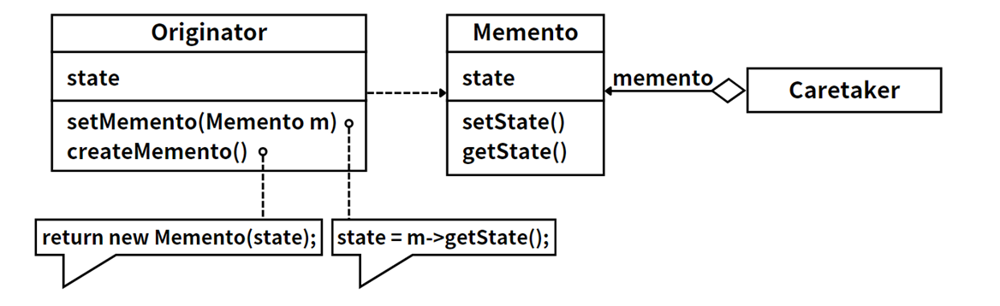

## 模式举例

我们可以在Java的序列化机制中看到备忘录模式的影子。

Java的序列化机制允许我们将一个对象的状态（也就是它的字段）保存到一个字节流中，然后我们可以从这个字节流中恢复这个对象。这个字节流就像是一个备忘录，它保存了对象的状态，我们可以用它来恢复对象。

## 模式定义

::: tip 定义

备忘录模式（Memento Pattern），**在不破坏封装的前提下，捕获一个对象的内部状态，并在该对象之外保存这个状态**，这样可以在以后将对象恢复到原先保存的状态。

:::

备忘录模式是一种行为设计模式，它允许在不暴露对象内部结构的情况下保存和恢复对象的内部状态。这种模式通常用于实现“撤销”或“恢复”操作。

备忘录模式常用于以下场景：

- 当你需要保存对象的快照以便稍后恢复时。
- 当直接访问对象的获取或设置操作可能会暴露细节并破坏封装时。

## 角色分析



备忘录模式主要包含以下三种角色：

1. **发起人（Originator）**：这是需要保存状态的对象。它定义了创建备忘录和恢复备忘录的方法。
2. **备忘录（Memento）**：这是一个用于保存发起人状态的对象。它只能被发起人访问。
3. **管理者（Caretaker）**：这是一个负责保存备忘录的对象。它不能操作或检查备忘录的内容。

## 示例代码

```java
import java.util.ArrayList;
import java.util.List;

class Memento {
    private final String state;

    public Memento(String state){
        this.state = state;
    }

    public String getState(){
        return state;
    }
}

class Originator {
    private String state;

    public void setState(String state){
        this.state = state;
    }

    public String getState(){
        return state;
    }

    public Memento saveStateToMemento(){
        return new Memento(state);
    }

    public void getStateFromMemento(Memento memento){
        state = memento.getState();
    }
}

class CareTaker {
    private final List<Memento> mementoList = new ArrayList<>();

    public void add(Memento state){
        mementoList.add(state);
    }

    public Memento get(int index){
        return mementoList.get(index);
    }
}

public class Client {
    public static void main(String[] args) {
        Originator originator = new Originator();
        CareTaker careTaker = new CareTaker();
        originator.setState("State #1");
        originator.setState("State #2");
        careTaker.add(originator.saveStateToMemento());
        originator.setState("State #3");
        careTaker.add(originator.saveStateToMemento());
        originator.setState("State #4");

        System.out.println("Current State: " + originator.getState());
        originator.getStateFromMemento(careTaker.get(0));
        System.out.println("First saved State: " + originator.getState());
        originator.getStateFromMemento(careTaker.get(1));
        System.out.println("Second saved State: " + originator.getState());
    }
}
```

运行结果：

```
Current State: State #4
First saved State: State #2
Second saved State: State #3
```

在这里，`Originator` 对象的状态被改变了多次，每次改变状态后，是可以将当前状态保存到一个新的 `Memento` 对象中，此时是由 `CareTaker` 对象进行保存。当需要恢复到某个状态时，`Originator` 对象可以从 `CareTaker` 对象获取相应的 `Memento` 对象，然后恢复其状态。

## 模式总结

备忘录模式提供了一种保存和恢复对象状态的机制，而无需暴露对象的内部结构。这种模式可以用于实现“撤销”或“恢复”操作，也可以用于实现事务（即一系列操作，要么全部成功，要么全部失败）。