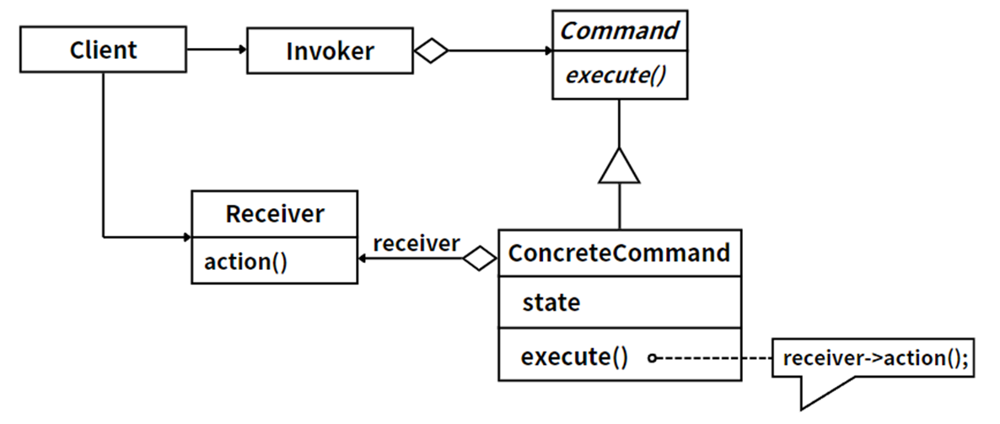

## 模式举例

`Java`的线程池`Executor`框架就是使用了命令模式。例如，`Runnable`接口就是命令接口，我们通过实现`Runnable`接口来创建具体的命令对象。线程池`Executor`就是请求者，它通过调用`Runnable`对象的`run`方法来执行命令。

## 模式定义

命令模式是一种行为设计模式，它将一个请求或操作封装为一个对象。这样做的目的是将发起请求的对象与执行请求的对象解耦，从而让程序的调用者和接收者相互独立，增强系统的灵活性和可扩展性。

::: tip 定义

命令模式（Command  Pattern），**将一个请求封装为一个对象，从而使我们可用不同的请求对客户进行参数化；对请求排队或者记录请求日志，以及支持可撤销的操作**。

:::

命令模式通过将请求或简单操作转换为一个对象，使得你可以将请求排队、记录、撤销或者合并。

## 角色分析



命令模式主要包含以下角色：

1. **命令（`Command`）**：这是一个接口，用于声明执行操作的方法，比如`execute`方法。
2. **具体命令（`ConcreteCommand`）**：这是命令接口的具体实现对象，它与接收者对象有一个关联关系，将调用接收者对象的方法，让接收者来真正执行一个请求。
3. **请求者（Invoker）**：请求者是发出命令的对象，通常会持有命令对象，可以是一个，也可以是一组命令。请求者不需要知道命令的任何实现细节，只需要调用命令对象的execute方法就可以。
4. **接收者（Receiver）**：接收者执行与请求相关的操作，它具体实现对请求的业务处理。

命令模式的关键在于引入了抽象命令类，请求发送者针对抽象命令类编程，只需要知道如何发送请求，而不必知道如何完成请求。这就是命令模式的模式动机。

## 示例代码

```java
// 命令接口
interface Command {
    void execute();
}

// 具体命令
class ConcreteCommand implements Command {
    private Receiver receiver;

    ConcreteCommand(Receiver receiver) {
        this.receiver = receiver;
    }

    @Override
    public void execute() {
        receiver.action();
    }
}

// 请求者
class Invoker {
    private Command command;

    Invoker(Command command) {
        this.command = command;
    }

    void call() {
        command.execute();
    }
}

// 接收者
class Receiver {
    void action() {
        System.out.println("执行请求！");
    }
}

// 客户端代码
public class Client {
    public static void main(String[] args) {
        Receiver receiver = new Receiver();
        Command command = new ConcreteCommand(receiver);
        Invoker invoker = new Invoker(command);
        invoker.call();
    }
}
```

## 模式总结

命令模式将请求或操作封装到一个对象中，使得我们可以使用不同的请求对客户进行参数化，对请求排队或记录请求日志，以及支持可撤销的操作。

这种模式可以将请求发送者和接收者解耦，发送者和接收者之间没有直接引用关系，发送者通过命令对象来间接调用接收者的方法。这种设计提供了很高的灵活性，使得我们可以方便地实现新的命令，而不需要改变已有的代码。