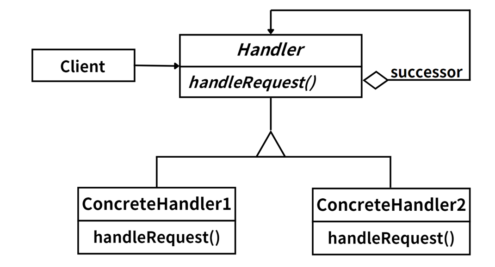

## 模式定义

Java Servlet API 中的 Filter 机制就是责任链模式的一个很好的例子。在 Servlet 容器（如 Tomcat）中，Filter 可以对 HTTP 请求进行预处理和后处理。这些 Filter 形成了一条处理链，每个 Filter 都有机会对同一个请求进行处理。

这种模式的优点是你可以动态地添加或删除 Filter，而不需要修改 Servlet 的代码。此外，每个 Filter 可以独立地处理请求，这使得代码更加模块化和可重用。

## 模式定义

责任链模式是一种行为设计模式，它允许将请求沿着处理者对象链进行传递，直到请求被处理或到达链的末端。这种模式可以降低对象之间的耦合度，增强系统的可扩展性，同时提供灵活的请求处理方式。

::: tip 定义

职责链模式（Chain of Responsibility  Pattern），避免请求发送者与接收者耦合在一起，让多个对象都有可能接收请求，**将这些对象连接成一条链，并且沿着这条链传递请求，直到有对象处理它为止**。

:::

在责任链模式中，发送者不需要知道接收者的详细信息，只需将请求发送到链上。我们可以根据需要动态地改变链内成员或调整它们的次序。 新增或移除责任处理者时，不会影响其他部分的代码。

一般来说，责任链模式适用于以下场景：

- 多个对象可以处理同一个请求，但具体由哪个对象处理则在运行时决定。
- 不想明确指定请求的接收者，而是想让多个对象都有机会处理这个请求。
- 可以动态指定请求的处理顺序。

## 角色分析



责任链模式主要包含以下角色：

1. **抽象处理者（Handler）**：定义了一个处理请求的接口，由于不同的具体处理者处理请求的方式不同，因此在其中定义了抽象请求处理方法。因为每一个处理者的下一个处理者是不确定的，所以在抽象处理者中定义了一个下一个处理者的链接。

2. **具体处理者（Concrete Handler）**：具体处理者接收到请求后，可以选择将请求处理掉，或者将请求传给下一个处理者。由于具体处理者可以接到或拒绝处理请求，因此可以实现链的动态组织。

3. **客户类（Client）**：创建了处理者链，并向链上的第一个处理者发送请求。

责任链模式的关键在于客户端不再与具体的处理者直接交互，而是将请求发送给链上的第一个处理者，通过每个处理者对链的引用，将请求传递给链上的下一个处理者，形成一个链式处理网络。这样可以降低系统的耦合度，增加新的请求处理类也非常方便。

## 示例代码

```java
// Handler: 定义处理请求的接口
interface Handler {
    void setNext(Handler handler);
    void handleRequest(String request);
}

// ConcreteHandler: 具体处理者1
class ConcreteHandler1 implements Handler {
    private Handler nextHandler;

    @Override
    public void setNext(Handler handler) {
        this.nextHandler = handler;
    }

    @Override
    public void handleRequest(String request) {
        if ("request1".equals(request)) {
            System.out.println("ConcreteHandler1 handled the request");
        } else if (nextHandler != null) {
            nextHandler.handleRequest(request);
        }
    }
}

// ConcreteHandler: 具体处理者2
class ConcreteHandler2 implements Handler {
    private Handler nextHandler;

    @Override
    public void setNext(Handler handler) {
        this.nextHandler = handler;
    }

    @Override
    public void handleRequest(String request) {
        if ("request2".equals(request)) {
            System.out.println("ConcreteHandler2 handled the request");
        } else if (nextHandler != null) {
            nextHandler.handleRequest(request);
        }
    }
}

// Client: 使用 Handler
public class Client {
    public static void main(String[] args) {
        Handler handler1 = new ConcreteHandler1();
        Handler handler2 = new ConcreteHandler2();

        handler1.setNext(handler2);

        handler1.handleRequest("request1");
        handler1.handleRequest("request2");
    }
}
```

## 模式总结

责任链模式将请求的发送者和接收者解耦，发送者和接收者之间没有直接引用关系，发送者只需要将请求发送给链上的第一个接收者，然后由链上的接收者决定如何处理请求。

这种设计提供了很高的灵活性，使得我们可以方便地添加、删除或者修改接收者，而不需要改变已有的代码。