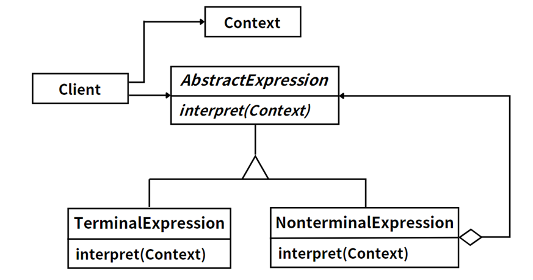

## 模式举例

`Java`的正则表达式处理就是解释器模式的一种思想体现。

在`Java`中，我们可以使用`Pattern`和`Matcher`类来编译和匹配正则表达式。这里的正则表达式就是一种语言，`Pattern`类将这种语言编译成一个抽象语法树，然后`Matcher`类就是一个解释器，它根据这个抽象语法树来解释和匹配字符串。

## 模式定义

解释器模式涉及到定义一种语言的文法，并提供一个解释器，该解释器能够解释用该语言编写的句子或表达式。

::: tip

解释器模式（Interpreter  Pattern），**定义语言的文法，并且建立一个解释器来解释该语言中的句子**，这里的“语言”是指使用规定格式和语法的代码。

:::

解释器模式常用于以下场景：

- 当有一个语言需要解释执行，并且你可以将该语言中的句子表示为一个抽象语法树时。
- 当存在一种简单的语法，这种语法适合于简单的客户端实现，复杂的语法可能需要语法树，这时候可以使用解释器模式。

## 角色分析



解释器模式通常包含以下几个角色：

- **抽象表达式（`AbstractExpression`）**：声明一个所有的具体表达式都需要实现的抽象接口。这个接口主要是一个`interpret()`方法，称作解释操作。
- **终结符表达式（`TerminalExpression`）**：实现与文法中的元素相关联的解释操作。通常一个解释器模式中只有一个终结符表达式，但有多个实例，对应不同的终结符。
- **非终结符表达式（`NonterminalExpression`）**：文法中的每一条规则对应于一个非终结符表达式，非终结符表达式一般是文法中的运算符或者其他关键字，比如公式`R=R1+R2`，公式`R`对应的就是一个非终结符表达式，解释操作就是求出`R1+R2`的值。
- **环境（`Context`）**：包含解释器之外的一些全局信息。

## 示例代码

```java
import java.util.HashMap;
import java.util.Map;

// Context类
class Context {
    private final Map<String, Integer> variables;

    public Context() {
        variables = new HashMap<>();
    }

    public int get(String name) {
        return variables.get(name);
    }

    public void set(String name, int value) {
        variables.put(name, value);
    }
}

// 抽象表达式
interface Expression {
    int interpret(Context context);
}

// 终结符表达式
class Number implements Expression {
    private final String name;

    public Number(String name){
        this.name = name; 
    }

    public int interpret(Context context){
        return context.get(name);
    }
}

// 非终结符表达式 - 加法
class Add implements Expression {
    private final Expression leftExpression;
    private final Expression rightExpression;

    public Add(Expression leftExpression, Expression rightExpression) { 
        this.leftExpression = leftExpression;
        this.rightExpression = rightExpression;
    }

    public int interpret(Context context) { 
        return leftExpression.interpret(context) + rightExpression.interpret(context);
    }
}

// 非终结符表达式 - 减法
class Subtract implements Expression {
    private final Expression leftExpression;
    private final Expression rightExpression;

    public Subtract(Expression leftExpression, Expression rightExpression) { 
        this.leftExpression = leftExpression;
        this.rightExpression = rightExpression;
    }

    public int interpret(Context context) { 
        return leftExpression.interpret(context) - rightExpression.interpret(context);
    }
}

// 测试代码
public class InterpreterPatternDemo {
    public static void main(String[] args) {
        Context context = new Context();
        context.set("a", 5);
        context.set("b", 3);

        Expression addExpression = new Add(new Number("a"), new Number("b"));
        System.out.println("a + b = " + addExpression.interpret(context));

        Expression subtractExpression = new Subtract(new Number("a"), new Number("b"));
        System.out.println("a - b = " + subtractExpression.interpret(context));
    }
}
```

运行结果：

```
a + b = 8
a - b = 2
```

## 模式总结

当有一个语言需要解释执行，并且你可以将该语言中的句子表示为一个抽象语法树的时候，可以使用解释器模式。而当存在以下情况时该模式效果最好：该文法简单对于复杂的文法，解释器模式的类层次变得庞大而无法管理。此时语法分析程序生成器这样的工具是更好的选择。它们无需构建抽象语法树即可解释表达式，这样可以节省空间而且还可能节省时间。

当效率不是一个关键问题的时候，例如，该文法可以很容易地改变或者扩展，而且你希望改变或者扩展文法的代价尽可能地低，可以使用解释器模式。

解释器模式也有其缺点，如可能引起类膨胀，解释器模式会引起大量的小类，而且由于语法规则的复杂性，这些类的数量可能会非常大。另外，解释器模式对于复杂、频繁变化的语法是难以应对的。

